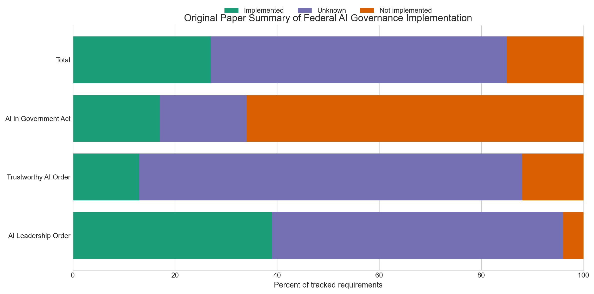
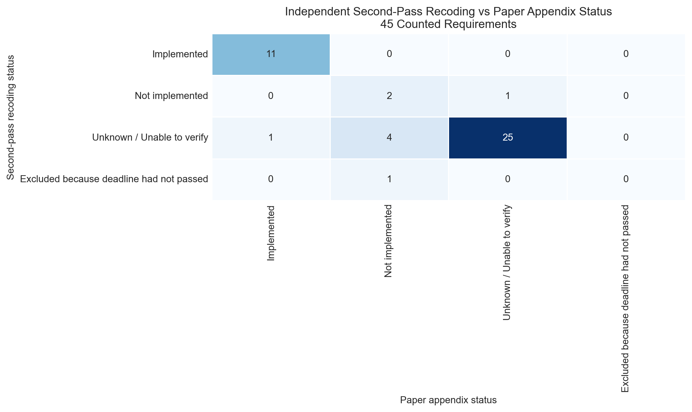

# Appendix Audit and Public Evidence Update of U.S. Federal AI Governance Implementation

This project reconstructs and studies the requirement-level analysis from a 2023 AIES paper on U.S. federal AI governance implementation. The goal was to understand how policy requirements become coded data, reproduce the paper's appendix-derived baseline, and compare that baseline with an independent second-pass coding and a limited July 24, 2026 public-evidence update.

The paper studied is:

**Lawrence, Cui, and Ho (2023). _The Bureaucratic Challenge to AI Governance: An Empirical Assessment of Implementation at U.S. Federal Agencies_.**

## Key Findings

1. The paper's prose reports `11` implemented requirements, but the appendix-derived counted baseline supports `12` implemented, `26` unknown, and `7` not implemented.
2. The independent second-pass recoding agreed with the paper appendix on `38 of 45` counted requirements, or `84.4%` agreement, with `κ = 0.71`.
3. Under a stricter public-evidence interpretation, several paper-era `Not implemented` rows are better treated as `Unknown / Unable to verify`; the paper's `7` not implemented rows become `3` not implemented in the second pass.
4. The July 24, 2026 update should be read as a limited public-evidence review, not as proof of agency noncompliance.

## Study Design

The repository covers three linked steps:

1. Appendix audit: reconstruct the 46-row tracker and the paper's 45-row counted baseline.
2. Independent baseline recoding: code the 45 counted requirements again using public evidence that would reasonably have been available by November 15, 2022.
3. July 24, 2026 update: review the same 45 counted requirements using later public evidence while preserving the original baseline fields.

The project focuses on three source instruments:

- Executive Order 13859
- Executive Order 13960
- The AI in Government Act of 2020

Later materials such as Executive Order 14110, OMB Memorandum M-24-10, Executive Order 14179, and OMB Memoranda M-25-21 and M-25-22 are used only as update-context sources for the 2026 review.

## Main Results

### Appendix-derived baseline

The reconstructed counted baseline supports:

- `12` implemented
- `26` unknown
- `7` not implemented

This is the main appendix-based discrepancy in the paper: the requirement-level baseline supports `12` implemented, while the prose reports `11`.



### Independent baseline recoding

The independent second-pass recoding produced:

- `11` implemented
- `3` not implemented
- `30` unknown or unable to verify
- `1` excluded because the deadline had not passed

This is where the project is most informative as a learning exercise. Re-reading the requirements under a stricter public-evidence rule shifts several rows away from `Not implemented` and toward `Unknown / Unable to verify`.



### July 24, 2026 public-evidence update

On the same 45 counted requirements, the July 24, 2026 update finds:

- `12` implemented
- `8` partially implemented
- `24` unable to verify
- `1` superseded or replaced
- `0` not implemented

These results should be read as a conservative review of what can be verified from public evidence. `Unable to verify` means the public record was insufficient for this project, not necessarily that the work did not happen.


## Interpretation

The appendix audit and the second-pass recoding point to the same general conclusion as the paper: many federal AI governance requirements are difficult to verify from public evidence alone. The more conservative second pass especially shows how much the final classification depends on whether the coder treats missing public artifacts as evidence of nonimplementation or as unresolved uncertainty.

The 2026 update adds a narrower point. Some obligations are easier to describe in 2026 than they were in late 2022, but a substantial share of the baseline still remains difficult to verify conservatively from public evidence alone.

## Limitations

This repository is built around public documents. That makes it useful for studying transparency, coding choices, and visible implementation, but it also means internal actions may be under-observed.

The independent second-pass recoding was designed to reduce direct reliance on the appendix statuses during assignment, but it was not a formal blinded study. The analyst had prior exposure to the appendix during the reconstruction step.

The July 24, 2026 review is intentionally scoped. It is a public-evidence update of the counted baseline, not a full agency-by-agency replication of the original paper.

## Files

The core reference files are:

- `data/raw/original_requirements.csv`
- `data/processed/original_second_pass_recoding.csv`
- `data/processed/implementation_status_summary.csv`
- `data/processed/implementation_status_summary_2026.csv`
- `data/processed/requirements_coded_2026.csv`
- `data/processed/row_audit_2026.csv`
- `data/processed/summary_stats.md`
- `data/data_dictionary.md`
- `report/policy_replication_report.md`

## AI Assistance Disclosure

AI assistance was used for repository scaffolding, code generation, source-search support, and draft organization. Coding decisions and interpretation were reviewed by the project author against public source evidence.

## How to Reproduce

1. Create a Python environment and install dependencies from `requirements.txt`.
2. Regenerate the appendix-derived baseline:

```bash
python src/build_original_replication_artifacts.py
```

3. Regenerate the independent second-pass recoding outputs:

```bash
python src/build_second_pass_recoding_artifacts.py
```

4. Regenerate the July 24, 2026 update outputs:

```bash
python src/build_2026_update_artifacts.py
```

5. Regenerate the row audit:

```bash
python src/build_row_audit_2026.py
```

6. Regenerate the summary counts used in this README and the report:

```bash
python src/build_summary_stats.py
```

The current counts quoted in this README are mirrored from `data/processed/summary_stats.md`.
