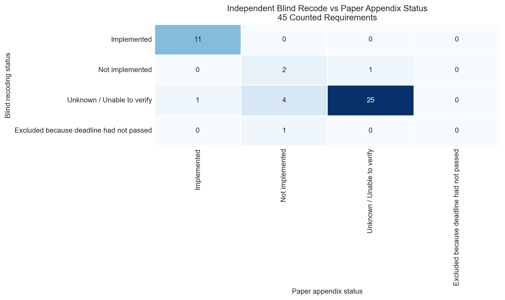
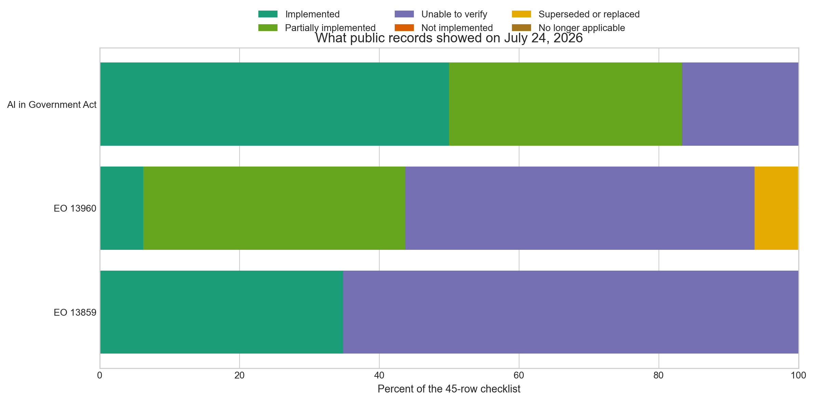
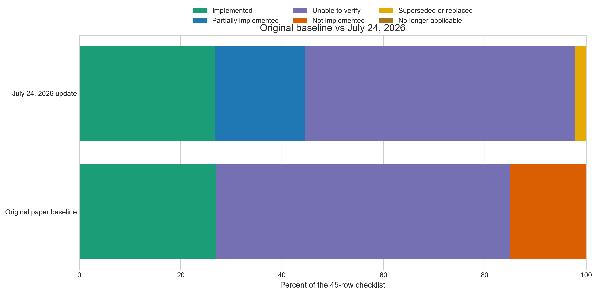
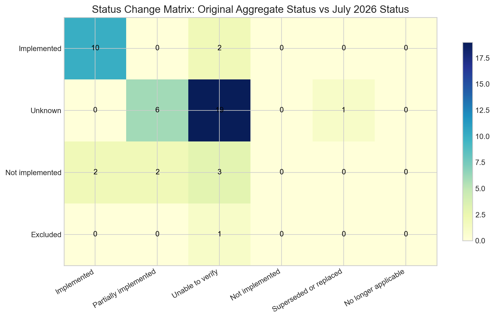
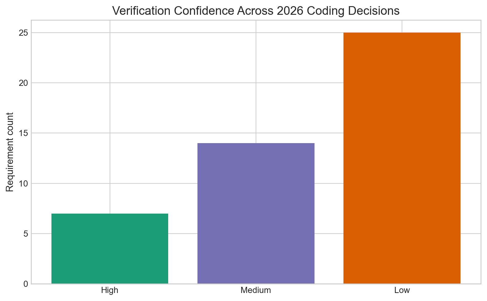

# Phase 1 MVP: Appendix Audit, Independent Baseline Recoding, and July 24, 2026 Public Evidence Update of U.S. Federal AI Governance Implementation

## Overview

This repository contains a replication-focused portfolio project based on:

**Lawrence, Cui, and Ho (2023). _The Bureaucratic Challenge to AI Governance: An Empirical Assessment of Implementation at U.S. Federal Agencies_.**

This repository is **Phase 1 MVP**, not a full end-to-end replication of every part of the original paper.

The project now has three linked goals:

1. Reconstruct the paper's appendix tracker and counted-baseline logic as transparently as possible.
2. Run an independent blind recoding of the original 45 counted requirements using only public evidence that would reasonably have been available by mid-November 2022.
3. Extend that baseline with a conservative requirement-level update coded on Friday, July 24, 2026, using only public evidence.

## Research Questions

1. Can the original paper's main implementation-status results be reconstructed from a requirement-level dataset?
2. How closely does an independent blind recoding pass agree with the paper's appendix-era status judgments?
3. What changed by July 24, 2026, when the same baseline is re-evaluated using public evidence?
4. Which federal AI governance requirements still remain difficult to verify publicly?

## Original Study

The original paper assessed implementation across three major U.S. federal AI governance pillars:

- Executive Order 13859, **Maintaining American Leadership in Artificial Intelligence**
- Executive Order 13960, **Promoting the Use of Trustworthy Artificial Intelligence in the Federal Government**
- The **AI in Government Act of 2020**

The authors used public materials gathered in late October through mid-November 2022 and concluded that fewer than 40 percent of the 45 counted legal requirements could be publicly verified as implemented.

## Current Project Scope

This repository is structured in three layers:

- An **appendix audit** that reconstructs the 46-row tracker and the 45-row counted baseline
- An **independent blind recode** of the original counted baseline using a November 15, 2022 public-evidence cutoff
- A **July 24, 2026 update** that preserves the baseline and adds a separate audited status layer
- An **optional full replication extension** that can later expand into deeper agency-level tracking and validation

## Data

The repository currently includes:

- `data/raw/source_documents_log.csv` for the paper, original policy texts, blind-recoding evidence sources, and official update-period sources
- `data/raw/original_requirements.csv` with the full appendix tracker plus counted-baseline flags
- `data/processed/original_blind_recoding.csv` with the independent Phase 1B blind-coding pass for the 45 counted rows
- `data/processed/blind_recoding_status_summary.csv` with the blind-recoding count distribution
- `data/processed/blind_recoding_vs_paper_comparison.csv` with the blind-recode versus paper appendix comparison matrix
- `data/processed/blind_recoding_agreement_rate.md` with the agreement-rate summary for the blind pass
- `data/processed/implementation_status_summary.csv` generated from the original counted baseline
- `data/processed/requirements_coded_2026.csv` with preserved baseline fields plus the July 24, 2026 coding layer
- `data/processed/implementation_status_summary_2026.csv` with both the comparable 45-row summary and the full 46-row tracker summary
- `data/processed/row_audit_2026.csv` with the Monday, July 27, 2026 review of the highest-risk row-level decisions from the July 24 pass
- `outputs/tables/requirement_status_table_2026.csv` and `outputs/tables/summary_table_2026.csv` for export-ready tables

## Methodology

The project follows the paper's basic logic:

1. Identify requirement-level legal or policy obligations.
2. Categorize them by source policy and responsible entity.
3. Reconcile the appendix-facing tracker against the 45-row counted baseline.
4. Run a blind recoding pass that uses only requirement metadata during assignment and joins back the appendix status only after coding is complete.
5. Preserve the original appendix-derived and aggregate-baseline fields.
6. Add a separate July 24, 2026 coding layer using only official public evidence.
7. Compare the baseline, blind recode, and 2026 update without overwriting the paper-era fields.

The 2026 pass uses six update categories:

- `Implemented`
- `Partially implemented`
- `Not implemented`
- `Unable to verify`
- `Superseded or replaced`
- `No longer applicable`

Two guardrails shape the update:

- The original paper baseline is preserved and never silently rewritten.
- If public evidence is weak or indirect, the row is coded as `Unable to verify` or assigned lower confidence instead of being pushed into `Implemented`.

## Policy Context for the 2026 Update

The update does not treat the policy environment as static.

- Executive Order 14110 added a major new federal AI governance layer in 2023.
- OMB Memorandum M-24-10 added agency-use guidance in 2024.
- Executive Order 14110 was revoked on January 20, 2025.
- Executive Order 14179 and OMB Memoranda M-25-21 and M-25-22 reshaped the federal AI policy environment in 2025.
- A White House national-security AI directive added another major layer on June 5, 2026.

Those later documents are used as **update-context sources only**, not as original replication sources.

## Results

Current progress:

- Source log expanded with the original paper, original policy pillars, blind-recoding evidence sources, and official update-period sources
- Original appendix tracker reconstructed at 46 rows, including the explicitly excluded `EO13960 section 5(c)(ii)` row
- Counted baseline regenerated at 45 included requirements using `aggregate_count_included`
- Original paper summary metrics regenerated from the requirement-level dataset
- Independent blind recoding completed for all 45 counted requirements using a `2022-11-15` public-evidence cutoff
- July 24, 2026 requirement-level coding completed in `data/processed/requirements_coded_2026.csv`
- 2026 summary, comparison, status-change, and confidence charts regenerated from the coded dataset

## Main Output Charts











## Independent Blind Recoding Findings

Using the paper's 45 counted requirements, the Phase 1B blind pass produced:

- `11` implemented (`24.4%`)
- `3` not implemented (`6.7%`)
- `30` unknown or unable to verify (`66.7%`)
- `1` excluded because the deadline had not passed (`2.2%`)

Comparison with the appendix-derived paper baseline:

- `38` of `45` rows matched the paper appendix status after normalizing label names
- Agreement rate: `84.4%`
- The largest disagreements came from the blind pass being more conservative about inferring public noncompliance from silence and more cautious about treating follow-on requirements as triggered when a prerequisite memo was missing

## July 24, 2026 Findings

Using the same 45 counted baseline requirements as the original paper, the audited update finds that the current public record supports:

- `12` implemented (`26.7%`)
- `8` partially implemented (`17.8%`)
- `24` unable to verify (`53.3%`)
- `1` superseded or replaced (`2.2%`)
- `0` not implemented

Interpretation:

- The public record is stronger in 2026 than it was in the original November 2022 baseline for some guidance, inventory, and workforce requirements.
- After the row audit, more of the tracker is intentionally held at `Unable to verify` because the public evidence is broad, indirect, or not requirement-specific enough to support stronger coding.
- Only one counted baseline row remains in `Superseded or replaced` after the audit applied a stricter standard for formal replacement or absorption.
- The confidence mix remains intentionally cautious across the 45 counted requirements: `7` high-confidence rows, `14` medium-confidence rows, and `24` low-confidence rows.

## How to Interpret the Results

- `Implemented` means public evidence directly supports completion of the requirement.
- `Partially implemented` means public evidence supports some but not all components of the requirement.
- `Unable to verify` means the public evidence reviewed here was insufficient. It does **not** necessarily mean the work was not done.
- `Superseded or replaced` means a later policy clearly replaced or absorbed the original requirement.

## Audit Note

On Monday, July 27, 2026, the project ran a focused audit of `36` high-risk rows from the committed July 24 coding pass.

- The audit reviewed all low-confidence rows, all `Partially implemented` rows, all `Superseded or replaced` rows, and all rows whose `status_change` was not the project's baseline-equivalent label `No material change`.
- The audit output is saved in `data/processed/row_audit_2026.csv`.
- The audit downgraded `9` rows to `Unable to verify`.
- The largest changes affected broad strategic rows, named-agency high-performance-computing allocation claims, the CIO Council inventory-guidance row, and several earlier supersession judgments that were not directly supported by public replacement evidence.

## Validation Note

The paper contains a small but important internal inconsistency.

- The appendix tracker structure supports **46 tracker rows**.
- Footnote 8 explicitly excludes `EO13960 section 5(c)(ii)` from the aggregate baseline because its deadline had not yet passed.
- After applying that exclusion, the counted baseline is **45 requirements** and reproduces **12 implemented, 26 unknown, and 7 not implemented**.
- The paper's narrative sentence in Section 5 says **11 implemented**, but that value does not match the appendix-derived baseline or the percentages shown in Table 1.

To keep the project transparent, the dataset preserves:

- the appendix-facing status in `appendix_status`
- the counted-baseline logic in `aggregate_count_included`
- the published prose count as a documented paper-level inconsistency rather than a silent data override

## Limitations

This project shares a core limitation with the original paper: it relies heavily on **publicly available evidence**.

That makes the project strong for measuring transparency and visible implementation, but it may undercount actions that occurred internally and were not clearly disclosed.

That limitation matters twice in this repository:

- in Phase 1B, where the blind recode intentionally avoids inferring too much from silence in the public record
- in the July 24, 2026 pass, where weak or indirect evidence is pushed back toward `Unable to verify`

The July 24, 2026 update, as tightened by the July 27 audit, is especially conservative. In several rows, later federal AI policy clearly exists, but the public record does not cleanly prove full completion, formal replacement, or direct fulfillment of the original underlying requirement. Those rows are therefore left at `Unable to verify` unless the evidence supports a narrower partial-implementation judgment.

## How to Reproduce

1. Create a Python environment.
2. Install dependencies from `requirements.txt`.
3. Run the original replication artifacts:

```bash
python src/build_original_replication_artifacts.py
```

4. Run the independent blind-recoding artifacts:

```bash
python src/build_blind_recoding_artifacts.py
```

5. Run the audited July 24, 2026 update artifacts:

```bash
python src/build_2026_update_artifacts.py
```

6. Run the focused row audit saved on Monday, July 27, 2026:

```bash
python src/build_row_audit_2026.py
```

7. If you want the notebook walkthrough, use the notebooks in order:
   - `01_build_requirement_dataset.ipynb`
   - `02_reproduce_original_results.ipynb`
   - `03_update_2026_status.ipynb`
   - `04_visualizations.ipynb`

## Repository Structure

```text
data/
notebooks/
outputs/
report/
src/
```

## Citation

Lawrence, Christie, Isaac Cui, and Daniel E. Ho. 2023. _The Bureaucratic Challenge to AI Governance: An Empirical Assessment of Implementation at U.S. Federal Agencies_. Proceedings of the AAAI/ACM Conference on AI, Ethics, and Society (AIES '23). https://doi.org/10.1145/3600211.3604701
